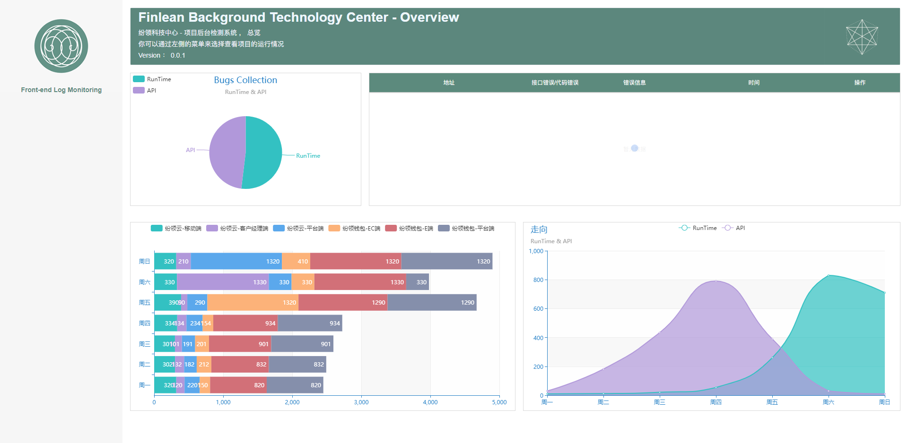

# frontEndLog
## 前端错误日志监控

  

主要功能：catch项目中的代码错误和请求接口错误，可以查看错误信息，错误统计，图表展示等功能；

错误记录插件：Hzq

后台统计系统：Hzq、TANGiMING、CL

Node.js服务：Hzq、c.y、TANGiMING

图表统计：TANGiMING

多项目测试工具：c.y

捕获页面代码错误
捕获接口错误
收集错误信息
